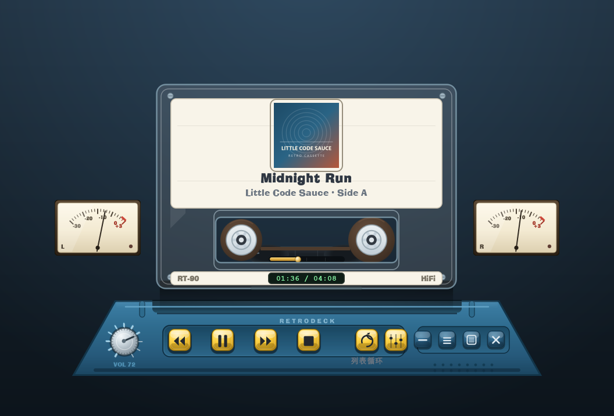
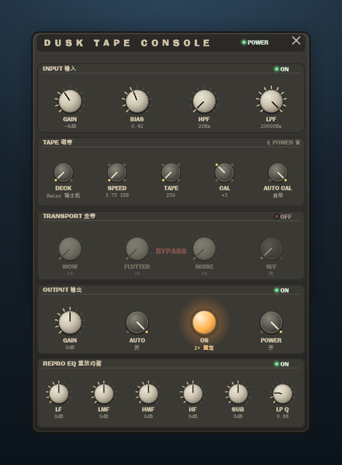
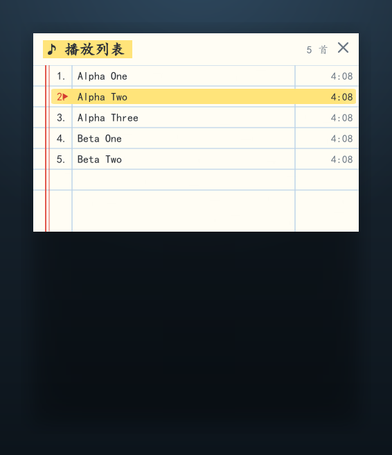
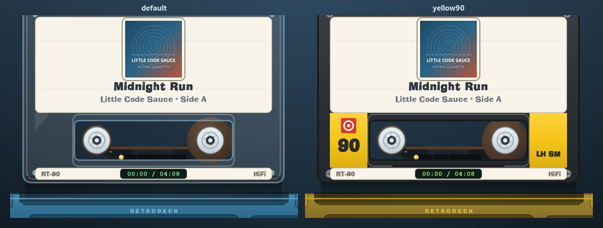

# 复古磁带播放器（Retro Cassette Player）

**v1.1.0** · Python + PySide6 · 全矢量界面 · 自带静态 ffmpeg



ffmpeg 驱动的桌面音乐播放器：主界面是一台全矢量绘制的磁带机（透明塑料磁带壳、梯形底座、两侧动圈 VU 表、
复古塑料键帽），播放列表是独立的**练习册风格悬浮窗**，另有一个**磁带 console 面板**用于磁带染色效果。
支持 mp3 / flac / m4a / aac / ogg / opus / wav / wma。

## 界面

| 主界面（磁带机 + VU 表 + 音量旋钮） | 磁带 console（22 个控件、每区可 bypass） |
| --- | --- |
|  |  |

| 练习册风格播放列表 | 皮肤可换（内置两套样板） |
| --- | --- |
|  |  |

## 特性

- **ffmpeg 解码**：任意 ffmpeg 支持的格式；项目自带静态 ffmpeg（`tools\ffmpeg`），无需装系统解码器。
- **无边框透明窗口**：除底座与磁带外全部透明（带柔和投影），没有标题栏 —— 按住磁带、底座或任意空白处
  即可拖动整个窗口，鼠标移到磁带区会变成抓手光标。
- **四种播放模式**：顺序播放 / 单曲循环 / 列表循环 / 随机播放，一键循环切换，按钮图标与状态文字同步变化。
- **转轴进度条**：观察窗里两个转轴之间就是进度条 —— 拖动它可跳转任意位置，拖动时左盘收带、右盘放带的
  卷径会跟着预览位置实时变化，计数器同时显示预览时间（变琥珀色），松手才真正跳转。
- **磁带染色（Dusk TapeMachine DSP）**：播放时把 PCM 过一遍真实磁带机模型（Jiles-Atherton 磁滞饱和、
  NAB/CCIR 重放均衡、偏磁/校准、哇音抖动、磁带噪声、磁头缝隙损耗、4× 过采样），在解码线程里处理，
  实测实时率 ×17、固有延迟 39 samples（约 0.8ms）。底座第五颗控制键呼出**复古 console 悬浮窗**：
  五个分区共 22 个旋钮/挡位旋钮（输入、磁带、走带、输出、重放均衡），面板与旋钮配色全部跟随皮肤包。
  **每个分区都能一键 bypass**（右上角 ON/OFF，把该区参数置中性并记住原值），顶栏 **POWER** 是 DSP 级总开关。
- **主界面 VU 表**：磁带机两侧一对动圈电平表，读数直接来自 DSP 的实际输出电平；指针起针快、回落慢，
  0dB 以上进红区并点亮过载灯。
- **音量旋钮**：底座左端一颗复古滚花旋钮，刻度环随音量亮起、指针跟着转，下方常显 `VOL xx` 读数。
  按住绕圈拧、滚轮微调，或直接键盘 `-`/`=`；按 `M` 静音/恢复。音量随会话记住，设备重启后自动灌回输出端。
- **计数器与播放键永远同步**：位置每 150ms 由引擎推送（只在整秒变化时重绘），LCD 的"当前 / 总时长"实时走动；
  播放键图标由引擎的播放状态信号驱动，切歌、换带、播完之后都不会出现"在播却显示播放三角"的错位。
- **换带不卡**：投影改成"内容轮廓一次性离线模糊成位图"（不再每帧做整窗高斯模糊）、底座与按钮合成到静态层缓存
  （动画帧只重画磁带）、动画用真实经过时间驱动（帧率波动不会拉长/抖动动画）、掐解码进程不再阻塞界面线程。
  上千首的列表切歌时也只重绘高亮那两行，不做全表排版。
- **启动不闪窗、不扫盘**：双击的是指向 `pythonw.exe` 的快捷方式（不是 .bat），全程没有控制台窗口；
  会话里带元数据快照，上千首的列表下次启动直接回填，不会一启动就在后台对每个文件跑 ffprobe。
- **全矢量界面**：QPainter 手绘底座、磁带壳、滚轴、塑料键帽、按钮图标；无 QML、无位图依赖，任意分辨率都锐利。
- **无控制台黑框**：所有 ffmpeg / ffprobe 子进程都以 `CREATE_NO_WINDOW` 启动，
  扫描文件夹或播放时不会再闪出一堆 cmd 窗口。
- **换带动画**：切歌时若**专辑不同**或**所在文件夹不同** → 磁带拔出（0.55s）+ 插入（0.65s，带回弹过冲）动画，
  新带在插入瞬间起播；同一专辑内切歌只触发滚轴快进爆发。
- **滚轴物理**：齿轮盘（卷芯）半径固定，磁带卷厚度随进度变化 —— 左盘（收带盘）卷越绕越厚、右盘（放带盘）越来越薄；
  角速度 ∝ 带速 / 卷径，因此小盘转得更快；播放 / 快进 / 快退方向不同，转速与方向都跟着变。
- **封面与元数据**：ffprobe 读标题 / 艺术家 / 专辑 / 时长（自动合并 albumartist），
  ffmpeg 抽取内嵌封面并按 `sha1(路径|mtime)` 缓存到 `.cache\covers`；无封面时用占位标签。
- **练习册播放列表**：奶白纸面 + 蓝色格线 + 双红线页边 + 行号「1.」+ 红色 ▶ 三角 + 当前曲目荧光笔高亮，
  双击任意行播放，标题栏可拖动，默认置顶。
- **皮肤包：v1.1.0 起整套界面都能换**。程序画出来的每一个图形都有资源键——底座、磁带外壳与内部、
  11 颗按钮 + 4 颗窗口键、VU 表盘与指针、音量旋钮、贴纸、进度条、计数器、磁带卷，以及
  **console 效果器面板**（分区凹槽/旋钮/指针/挡位/拨杆/挡位灯/指示灯）和**播放列表纸张**，共 **44 个键**。
  资源既可以是 SVG 也可以是 PNG。

  几个关键约定（详见 [皮肤制作指南](docs/SKIN_GUIDE.md)）：

  | 类型 | 约定 |
  | --- | --- |
  | 状态变体 | 加 `_hover` / `_down` / `_on` / `_off` 后缀，缺失则程序调制颜色 |
  | 指针类（`vu_needle`、`*_pointer`、`*_lever`） | 正方形、**中心即转轴**、画成竖直朝上；程序按数值顺时针旋转 |
  | 单元素叠加（`knob_vol_lit`、`*_dot`） | 只画**一个**元素，程序按位置反复贴——于是"刻度逐道亮起"这类动态效果也能换皮 |
  | 缩放/裁剪（`reel_coil`、`prog_fill`） | 画**极限状态**（满卷 / 满值），程序按数值缩放或裁剪 |

  一条界线：**资源给形状，程序给数值**——文本与数字、条数随内容变化的格线留在程序里。

  `skins\default`（44 个资源，蓝黄配色）与 `skins\yellow90`（21 张金色图 + console 回退程序绘制）
  是两套样板，后者示范了"只覆盖外观主体"的最省写法。皮肤之间可 `base_pack` 继承；
  **任何资源缺失或把键写成空串都会自动回退成内置矢量绘制**，所以不完整的皮肤包也能安全运行。
- **播放列表持久化**：菜单可把列表存成 M3U8（也认 M3U/JSON），退出时自动记住列表、当前曲目、播放模式与进度，
  下次启动原样恢复（不会突然出声）。
- **无音卡也能跑**：播放位置按真实时间推进（虚拟实时模式），没有音频设备时静音运行、不报错。

## 快速开始

```powershell
cd H:\doc_research\retro_cassette_player

# 1) 虚拟环境（依赖只装进项目 venv）
uv venv --python 3.12 .venv
$env:HTTP_PROXY="http://127.0.0.1:2333"; $env:HTTPS_PROXY="http://127.0.0.1:2333"
uv pip install -r requirements.txt

# 2) ffmpeg 静态构建放入 tools\ffmpeg\（需含 ffmpeg.exe 与 ffprobe.exe）

# 3) 运行
.\.venv\Scripts\python.exe main.py     # 或双击 run.bat（会闪一下 cmd 窗口）
```

### 想要优雅地启动（无 cmd 窗口）

```powershell
.\.venv\Scripts\python.exe tools\make_launcher.py     # 生成 icon.ico + 项目根与桌面的快捷方式
```

之后双击桌面的「复古磁带播放器」即可：快捷方式直接指向 `pythonw.exe`，**全程没有控制台窗口**，
带磁带图标，可以固定到任务栏或开始菜单。`run.bat` 仍保留（供命令行排查用，但它自己是个批处理，
双击时必然会闪一下 cmd 窗口，这是 Windows 的行为，不是播放器弹的）。

## 操作

| 位置 | 操作 | 说明 |
| --- | --- | --- |
| 菜单按钮（☰） | 打开文件 / 打开文件夹 / 添加到播放列表 / 打开播放列表 / 保存播放列表 / 皮肤 / 列表窗置顶 / 关于 | 打开文件夹会递归扫描音频 |
| ⏮ ⏯ ⏭ ⏹ | 上一首 / 播放暂停 / 下一首 / 停止（归零） | 播放中时播放键自动切换为暂停图标（双竖线），状态由引擎信号驱动 |
| **观察窗进度条** | 拖动两个转轴之间那条进度条 | 拖动中显示预览时间、两盘卷径随预览变化；松手跳转；抓它时不会误拖窗口 |
| **音量旋钮** | 按住旋钮绕圈拧 / 滚轮 / `-` `=` / `M` 静音 | 刻度环与指针实时跟随，底座上常显 `VOL xx`；音量随会话记住 |
| **磁带 console** | 底座第五颗控制键（推子图标）呼出/收起 | 面板空白处可拖动；旋钮绕圈拧、滚轮微调、挡位旋钮点击换挡；每个分区右上角有 **ON/OFF 一键 bypass**，顶栏 **POWER** 是 DSP 级总开关 |
| **VU 表** | 磁带机两侧，无需操作 | 读数来自磁带 DSP 的实际电平，0dB 以上亮过载灯 |

## 配置与文件位置

**所有持久化都在软件目录内，不写 C 盘、不写用户目录**（`config` 与源码同一棵树，绿色拷贝可整体搬走）：

| 文件 | 内容 | 是否进 git |
| --- | --- | --- |
| `config\settings.json` | 软件配置：音量、皮肤、效果器参数与分区开关、窗口位置 | ❌ 已忽略 |
| `.cache\session.json` | 播放会话：列表、当前曲目、播放模式、进度（含元数据快照） | ❌ 已忽略 |
| `.cache\covers\` | 封面缓存 | ❌ 已忽略 |
| `config\app.log` | 运行日志（pythonw 无控制台时 `print` 会被静默丢弃，这里兜底落盘便于排查） | ❌ 已忽略 |
| `tools\dusk\dusk_dsp.dll` | 磁带 DSP 编译产物 | ❌ 已忽略 |
| `icon.ico` / `*.lnk` | 图标与启动快捷方式（可由脚本再生成） | ❌ 已忽略 |

配置是**原子写入**的（临时文件 + 替换），损坏或缺失时自动退回默认值；首次运行若发现旧会话里存过音量／效果器参数，
会自动继承一次，之后各归各处。`.gitignore` 规则已用临时仓库实测：源码照常跟踪，上表这些一律不上传。
| 循环键 | 顺序播放 → 单曲循环 → 列表循环 → 随机播放 | 按钮图标（箭头/1/回路/交叉）与状态文字同步切换 |
| 拖动 | 按住磁带、底座或任意空白处拖动整个窗口 | 无标题栏；磁带区与空白区都可拖，按钮区不触发拖动 |
| 文档按钮 | 显示 / 隐藏播放列表悬浮窗 | 列表内双击行可直接播放 |
| − ✕ | 最小化 / 退出 | |
| 快捷键 | `空格` 播放暂停，`←/→` 后退/前进 5 秒，`N`/`↓` 下一首，`P`/`↑` 上一首，`L` 切换循环，`-`/`=` 音量，`M` 静音 | 焦点在主界面时有效 |
| 播放列表 | 拖动标题栏移动，`✕` 关闭（仅隐藏） | |
| 列表持久化 | 菜单 → 保存播放列表（M3U8）/ 打开播放列表（M3U8/M3U/JSON） | 退出时还会把列表、当前曲目、播放模式与进度记到 `.cache\session.json`，下次启动自动恢复（不自动出声） |

## 目录结构

```
main.py                 装配层：引擎 + 模型 + 两个窗口 + 菜单
app/audio_engine.py     ffmpeg 管道解码 + QAudioSink 输出 + 位置/暂停/跳转
app/media_info.py       ffprobe 元数据、封面抽取、后台扫描/探测线程
app/playlist_model.py   播放队列、四种播放模式（含随机+历史回退）、换带判定
app/playlist_io.py      播放列表持久化：M3U8 读写 + 会话（列表/模式/进度）恢复
app/tape_fx.py         磁带 DSP 的 Python 绑定层（DLL 缺失时自动直通；许可隔离层）
app/settings.py        软件配置读写（config\settings.json，绝不写系统盘）
app/console_window.py  复古磁带 console 悬浮窗（面板/旋钮/挡位旋钮全自绘 + 皮肤）
app/proc_util.py        Windows 子进程无窗口封装（消除 cmd 黑框）
app/tape_anim.py        磁带动画状态机：滚轴物理 + 快进爆发 + 拔出/插入
app/deck_widget.py      主界面绘制与交互（矢量底座/磁带/按钮/图标）
app/playlist_window.py  练习册式播放列表（无边框悬浮窗）
app/shadow_window.py    无边框 + 半透明 + 投影的悬浮窗基类
app/skin_loader.py      皮肤包加载（skin.json + svg/png）与回退绘制
app/smoke.py            offscreen 冒烟测试 + 关键帧截图
skins/default/          内置皮肤样板：透明塑料壳（底座 + 磁带外壳/内部 4 个资源 + skin.json，按钮由程序绘制）
skins/yellow90/         第二套样板：经典黄黑不透明外壳 + 挖穿的观察窗（继承 default 其余部件）
tools/make_launcher.py  生成程序图标（多尺寸 ico）与无控制台启动快捷方式
tools/build_dusk_dsp.ps1  编译磁带 DSP（third_party/dusk_ctm → tools\dusk\dusk_dsp.dll）
third_party/dusk_ctm/   磁带 DSP 核心（上游 dusk-audio-plugins，GPL-3.0-or-later，见其 README）
tools/ffmpeg/           静态 ffmpeg / ffprobe
icon.ico                程序图标（由 make_launcher.py 生成，main.py 用作窗口图标）
tests/samples/          测试音频（Alpha 3 首 / Beta 2 首）
tests/shots/            冒烟测试截图
tests/skin_preview.py   皮肤预览工具：把每个皮肤包的磁带特写并排渲染成一张图
tests/bench_frames.py   帧耗时基准：对比绘制路径、测换带起步阻塞与列表重绘成本
tests/verify_session.py 会话恢复自检：旧格式兼容、元数据快照、按需探测
tests/verify_playlist_io.py  播放列表读写自检（M3U8 往返 + 会话恢复）
```

## 皮肤包规范

想做皮肤请直接看 **[docs/SKIN_GUIDE.md](docs/SKIN_GUIDE.md)**（含完整配色表、几何表、资源表、磁带分层坐标与常见坑）。
下面是速查版。

复制 `skins\default` 改名（如 `skins\my-skin`），重启后在菜单 → 皮肤里切换。

`skin.json` 三个可选段，全部省略即使用内置默认值：

```json
{
  "colors": { "base": "#2a6485", "btn_bg": "#ffd23f" },
  "layout": { "tape": [220, 96, 520, 356], "btn_play": [312, 506, 46, 46] },
  "assets": { "base": "base.svg", "win_list": "icons/win_list.svg" }
}
```

配色键：`bg` 背景、`base`/`base_edge`/`base_lip` 底座主体/描边/高光、`btn_bg`/`btn_hover`/`btn_glyph`
控制按钮，`chrome_bg`/`chrome_hover`/`chrome_glyph` 窗口按钮，`tape_shell`/`tape_edge`/`tape_screw` 磁带壳，
`reel_disc`/`reel_hub`/`reel_spoke` 滚轴，`text_title`/`text_sub` 磁带文字，`lcd_bg`/`lcd_fg` 计数器。

几何键（窗口固定 960×620，值为 `[x, y, w, h]`）：`tape`、`base`、`btn_prev`、`btn_play`、`btn_next`、
`btn_stop`、`btn_loop`、`knob`（音量旋钮，正方形区域，程序按中心/半径绘制）、`win_min`、`win_menu`、
`win_list`、`win_close`。

资源键与画布尺寸（SVG 用 `viewBox` 匹配，PNG 按同尺寸导出即可）：

| 资源键 | 尺寸 | 说明 |
| --- | --- | --- |
| `base` | 808×132 | 底座，上沿内缩 74px 的梯形 |
| `tape_inner` | 520×356 | **磁带内部**（观察窗承座、卷盘凹槽、导带柱）；磁带卷、卷芯齿轮盘与进度条由程序画在上面 |
| `tape_shell` | 520×356 | **磁带外壳**，画在内部之上；透明/半透明贴图即可透出内部结构（观察窗处要挖穿，见下） |
| `reel_hub` | 正方形 | 可选：卷芯齿轮盘贴图，程序按转动角度旋转；缺省用内置矢量齿轮盘 |
| `btn_prev` `btn_next` `btn_stop` `btn_play` `btn_pause` | 46×46 | 可选：控制按钮整图；**缺省由程序绘制复古塑料键帽 + 矢量图标**（带键槽、倒角高光、按下下沉） |
| `btn_sequence` `btn_repeat_one` `btn_loop` `btn_shuffle` | 46×46 | 可选：循环键四种模式的整图；缺省同上 |
| `win_min` `win_menu` `win_list` `win_close` | 34×34 | 可选：窗口按钮；缺省由程序绘制 |
| `cover_placeholder` | 132×132 | 无封面时的占位图 |

按钮默认由程序绘制：键帽在底座凹槽里、有上亮下暗的塑料渐变与按下下沉反馈，图标是矢量蚀刻。
想让按钮换成自己的贴图，就在 `assets` 里给出同名资源；反过来，若想**丢掉继承来的某张资源、改回程序绘制**，
把该键写成空字符串即可（`"base": ""`，`skins\yellow90` 就是这么让底座跟着配色走的）。

**磁带分层与观察窗**：程序按 `tape_inner → tape_shell → 贴纸(封面/标题) → 计数器` 的顺序绘制。
外壳若为不透明贴图，必须把观察窗挖穿，内部才看得见；窗口区在 520×356 画布上为 `x 104..416, y 222..318`：

```svg
<path fill-rule="evenodd" fill="#2f3336"
      d="M 18 2.5 H 502 A 15.5 15.5 0 0 1 517.5 18 V 338 A 15.5 15.5 0 0 1 502 353.5
         H 18 A 15.5 15.5 0 0 1 2.5 338 V 18 A 15.5 15.5 0 0 1 18 2.5 Z
         M 113 231 H 407 A 9 9 0 0 1 416 240 V 300 A 9 9 0 0 1 407 309
         H 113 A 9 9 0 0 1 104 300 V 240 A 9 9 0 0 1 113 231 Z"/>
```

**皮肤继承**：`skin.json` 里写 `"base_pack": "default"`，先加载该包的配色与资源，再用本包的覆盖。
`skins\yellow90` 就是例子——它只提供外壳与配色，按钮/内部结构全部继承默认皮肤。

规则：资源缺项或加载失败 → 自动回退内置矢量绘制；SVG 会被拉伸到目标矩形，因此画布比例应与上表一致。
改完皮肤跑 `tests\skin_preview.py` 会把所有皮肤包的磁带特写并排渲染成一张对比图（输出到 `tests\shots\10_skin_compare.png`）。

## 音频链路（为什么这样设计）

```
音频文件 ──ffmpeg -f s16le pipe:1──▶ 读取线程 ──▶ 环形缓冲(上限 8s，背压) ──▶ QAudioSink.start() 返回的 QIODevice
```

- **位置语义**：播放位置 = 已投递给输出设备的 PCM 字节数 ÷ 192000 B/s（48kHz/立体声/16bit）。
  不按"管道读出量"计，因为 ffmpeg 解码远快于实时（8 秒的曲子 0.3 秒就解完）。
- **实时配额**：每次投递最多推进到"已播时间 + 0.18s 前瞻"，既保证不欠载，又不会因设备吞得快而瞬间"播完"。
- **虚拟实时兜底**：没有可用音频设备（或设备长时间不消费数据）时自动降级为按真实时间节流，静音"播放"，
  位置、结束信号、自动下一首照常工作，因此无音卡环境（CI / offscreen）也能完整测试。
- **背压**：解码缓冲超过 8 秒时读取线程等待消费，不做丢弃，长曲目不会丢音频。
- **暂停 / 跳转**：关闭进程并带 `-ss` 重新起解码进程；代际号防止旧读线程污染状态。

## 自检与截图

```powershell
.\.venv\Scripts\python.exe app\smoke.py                    # 功能全时间线 + 截图
.\.venv\Scripts\python.exe tests\verify_playlist_io.py     # M3U8 往返 / 会话恢复
.\.venv\Scripts\python.exe tests\verify_session.py         # 会话兼容与按需探测
.\.venv\Scripts\python.exe tests\verify_tape_fx.py         # 磁带 DSP：加载 / PCM 往返 / 参数 / POWER
.\.venv\Scripts\python.exe tests\verify_tape_params.py     # 逐个参数扫描：谁有效、谁会把输出搞坏
.\.venv\Scripts\python.exe tests\verify_fx_latency.py      # 实测"改参数 → 生效"的延迟
.\.venv\Scripts\python.exe tests\diag_audio_underrun.py    # 实测输出链路欠载（真实设备，音量 0 不出声）
.\.venv\Scripts\python.exe tests\bench_frames.py           # 帧耗时基准
```

音频输出走 **pull 模式**：Qt 的音频线程调用 `PcmSource.readData()` 来取数据，磁带 DSP 在
那里现场处理——既不在 GUI 线程（打开面板、换带动画不会饿死它），也不在解码线程（不经过
秒级预读）。Windows 上 Qt6 用的是 **WASAPI 共享模式**，设备缓冲设为 120ms。

以上脚本都**静音运行**（offscreen + `RETRO_MUTE=1`，强制不打开音频输出设备），
不会在调试时把声音送到耳机。手动调试时也可以自己设 `RETRO_MUTE=1` 达到同样效果。

三个验证脚本都会先把用户的 `.cache\session.json` 挪走、结束时（含断言失败）原样放回，不会动你的播放列表。

offscreen 渲染跑完整时间线（上带 → 播放 → 同专辑切歌 → seek+5s → 暂停/恢复 → 拖进度条 → 换带动画 →
自然播完 → 自动下一首），断言：皮肤资源装载、主窗口空白区 `alpha=0`（背景真透明）、四种播放模式循环切换、
随机模式不重复取曲、位置按实时推进、**计数器整秒确实在变（LCD 会重绘）**、**播放键状态与引擎一致**、
**进度条拖动会跳转且不会误拖窗口**、**VU 表读数跟随 DSP 电平**、**console 旋钮/挡位能抵达 DSP**、
`track_ended` 触发、换带与自动切歌索引正确，
并把关键帧截图写入 `tests\shots\`（`01_playing.png` 等为透明 PNG，另存 `*_preview.png` 是叠了演示底色的版本，
`07_paused.png` / `08_progress_drag.png` / `10_console.png` 分别是暂停态、拖动进度条、console 面板的样子）。

## 许可与第三方代码

本项目以 **GNU GPL v3.0 或更高版本**发布（见 [LICENSE](LICENSE)）。

之所以是 GPL：磁带染色用的是 [dusk-audio/dusk-audio-plugins](https://github.com/dusk-audio/dusk-audio-plugins)
里 TapeMachine 的框架无关 DSP 核心（`third_party/dusk_ctm/`，GPL-3.0-or-later，版权头与原 LICENSE 一并保留），
程序**链接**了它，因此整体以同一许可发布。

- 只想在自己的机器上用、不打算再分发：GPL 不产生任何额外义务。
- 不想让整个程序是 GPL：把 `app/tape_fx.py` 换成**独立子进程**管线（进程边界，接口调用而非链接），
  或按公开的物理模型自己重写那份 DSP。所有 DSP 调用都收敛在这一个文件里，替换形态只改它；
  找不到 DLL 时程序照常运行，只是没有磁带染色。

## 已知限制

- 播放列表窗口为无边框悬浮窗，不支持系统级边缘吸附。
- 未内建音频输出设备选择与音量控制（跟随系统音量）。- ffmpeg 静态构建体积较大，仓库中默认忽略（`tools/ffmpeg/`）。
